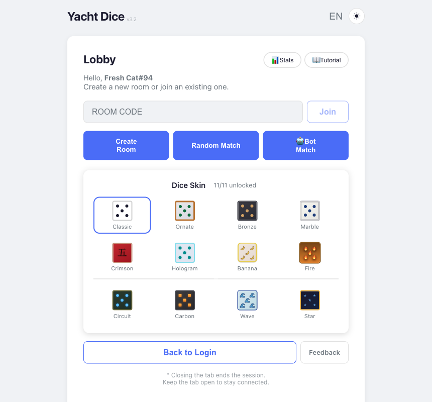
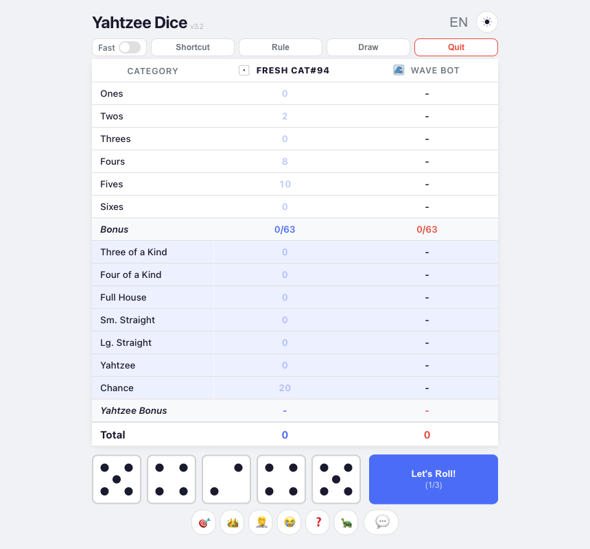
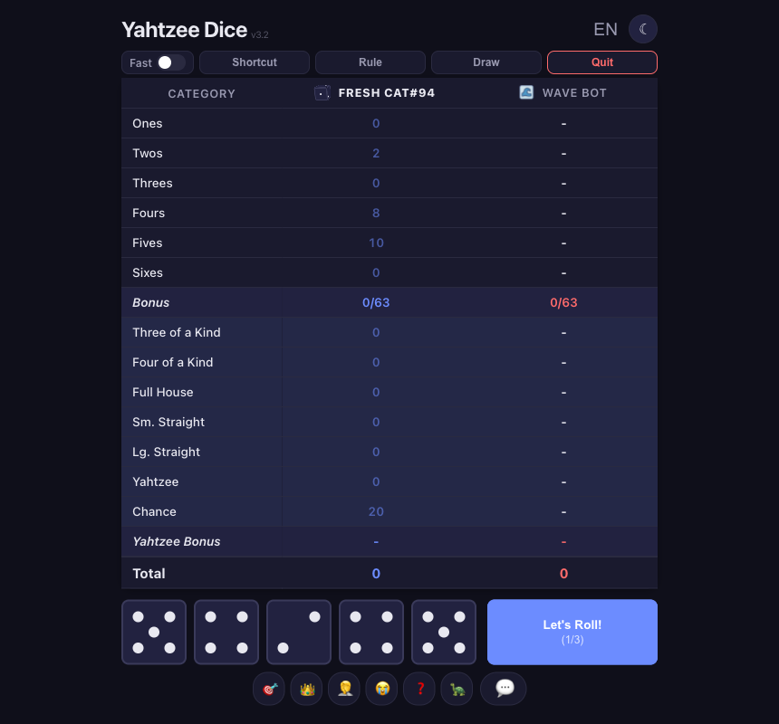
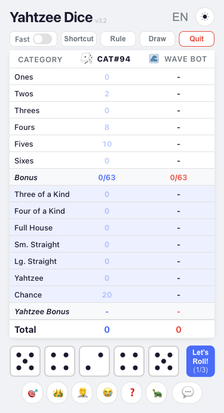

# Yacht Dice

**[한국어](README.ko.md)** | English

A 1v1 online multiplayer dice game. Supports two game modes: **Yacht** (12 categories) and **Yahtzee** (13 categories + bonus).

> Live: https://yacht-ff0c8.web.app

## Screenshots

| Lobby & Skins | Gameplay |
|:---:|:---:|
|  |  |

| Dark Mode | Mobile |
|:---:|:---:|
|  | &nbsp;&nbsp;&nbsp;&nbsp;&nbsp;&nbsp;&nbsp;&nbsp;&nbsp;&nbsp;&nbsp;&nbsp;&nbsp;&nbsp;&nbsp;&nbsp;&nbsp;&nbsp;&nbsp;&nbsp;&nbsp;&nbsp;&nbsp;&nbsp; |

## Features

- **Two Game Modes** — Choose between Yacht and Yahtzee
- **Real-time Multiplayer** — Play with friends via 6-digit room code, or find opponents with Random Match (Yahtzee / Yacht / Any mode)
- **Google Login / Guest** — Game history saved with Google OAuth login; guest play also available
- **History & Stats** — Win rate, recent game records (logged-in users only)
- **Dice Skins** — 12 skins (Classic, Ornate, Bronze, Marble, Crimson, Hologram, Circuit, Banana, Carbon, Wave, Fire, Star), unlocked by game count / Bot wins / win streak
- **Dark Mode** — Light/dark theme toggle with real-time skin switching (WCAG AA contrast compliant)
- **Emotes** — 16 emoji chat options, keyboard shortcuts (Q/W/E/R/T/Y), server-side rate limiting
- **Reconnection** — Auto-reconnect on tab return, concurrent tab conflict detection
- **Offline Detection** — Blocks game actions on network loss with toast notification
- **Bot Match** — Three difficulties: Basic (occasional mistakes) / Gambler (optimal play) / Wave (win-probability maximizing endgame via Web Worker), powered by Expectimax DP
- **Server-side Validation** — Anti-cheat score calculation via Cloud Functions, transaction-based rate limiting
- **Abuse Prevention** — Bot game tab close saves as loss (sendBeacon), minimum score threshold invalidation (excluded from win rate and streaks)
- **App Check** — Firebase App Check (reCAPTCHA v3) prevents unauthorized use of backend services from forked apps
- **Bilingual** — English/Korean dual language support with real-time switching
- **Tutorial** — Interactive step-by-step game guide
- **Accessibility** — aria-labels, keyboard navigation, screen reader support
- **No Build Step** — Pure HTML, CSS, JavaScript (no bundlers or frameworks)

## Tech Stack

| Area | Technology |
|---|---|
| Frontend | HTML5, CSS3, Vanilla JS (ES5) |
| Backend | Firebase Realtime Database |
| Auth | Firebase Auth (Google OAuth + Anonymous) |
| Anti-Cheat | Firebase Cloud Functions (Node 22) |
| App Check | Firebase App Check (reCAPTCHA v3) |
| Hosting | Firebase Hosting (Global CDN, Auto SSL) |
| CI/CD | GitHub Actions (Auto deploy Hosting + Functions + DB Rules on main push) |

## Project Structure

```
yacht_for_hw/
├── index.html                # SPA entry (all screens included)
├── css/
│   └── style.css             # All styles (themes, skins, responsive)
├── js/
│   ├── firebase-config.js    # Firebase init + App Check (reCAPTCHA v3) + emulator auto-connect + sendBeacon URL
│   ├── auth.js               # Google login / guest mode
│   ├── lobby.js              # Room create/join, presence, reconnection
│   ├── game.js               # Game state machine, turn management, Firebase sync, deferred score preview
│   ├── scoring.js            # Yacht / Yahtzee score calculation (client-side)
│   ├── dice.js               # Dice rendering, roll animation, stagger stop
│   ├── dice-skins.js         # Skin system (unlock, select, save)
│   ├── bot-ai.js             # Bot AI (DP lookup table-based optimal strategy, endgame worker management)
│   ├── bot-game.js           # Bot match controller (local state, turns, emotes, tab close loss save)
│   ├── endgame-worker.js     # Web Worker for win-probability maximization (Wave bot endgame)
│   ├── history.js            # Game history save/query
│   ├── i18n.js               # English/Korean bilingual
│   ├── nickname.js           # Nickname generation/management (per language)
│   ├── tutorial.js           # Interactive tutorial
│   ├── ui.js                 # Screen transitions, scorecard (event delegation), toast (dynamic duration)
│   └── app.js                # Entry point, module wiring, emotes, offline detection, tab conflict, ID token caching, App Check token caching
├── die_image/                # Image-based dice skin assets (Banana, Wave, Fire)
├── data/
│   ├── dp_yacht.bin          # Yacht mode DP lookup table (Uint16, 8KB)
│   └── dp_yahtzee.bin        # Yahtzee mode DP lookup table (Uint16, 2MB)
├── tools/
│   └── generate_dp.py        # Expectimax DP table generator (Python/NumPy/Numba)
├── functions/
│   ├── index.js              # Cloud Functions (rooms, random match, dice, score validation, draw, bot results, invalidation)
│   ├── scoring.js            # Server-side score calculation logic
│   └── package.json
├── .github/workflows/
│   └── firebase-hosting-merge.yml    # Auto deploy on main push (Hosting + Functions + DB Rules)
├── firebase.json             # Hosting, Functions, Database, Emulator config
├── .firebaserc               # Firebase project link (yacht-ff0c8)
├── database.rules.json       # Realtime Database security rules
├── CLAUDE.md                 # Project rules for AI assistant
└── README.md
```

## How to Play

1. On the login screen, choose **Google Login** or **enter a guest name**
2. In the lobby, **Create Room** → select game mode → share the 6-digit code with your opponent
3. Opponent selects **Join** → enters the code (or **Random Match** → select game mode → find opponent)
4. Each turn, roll dice up to 3 times, click (or press 1-5) to hold/release, then select a category on the scorecard
5. Game ends when all categories are filled — highest total score wins

## Game Rules

### Yacht (12 categories)

| Category | Score |
|---|---|
| Ones -- Sixes | Sum of matching dice |
| Four of a Kind | Sum of four matching dice |
| Full House | Sum of all dice when 3+2 combination |
| Small Straight (1-2-3-4-5) | 30 points |
| Large Straight (2-3-4-5-6) | 30 points |
| Choice | Sum of all dice |
| Yacht (all 5 the same) | 50 points |

### Yahtzee (13 categories)

| Category | Score |
|---|---|
| Ones -- Sixes | Sum of matching dice |
| Three of a Kind | Sum of all dice when 3+ match |
| Four of a Kind | Sum of all dice when 4+ match |
| Full House | 25 points (fixed) |
| Small Straight (4 in sequence) | 30 points |
| Large Straight (5 in sequence) | 40 points |
| Yahtzee (all 5 the same) | 50 points |
| Chance | Sum of all dice |
| **Upper Bonus** | +35 points when upper total >= 63 |
| **Yahtzee Bonus** | +100 points per additional Yahtzee |

## Development

### Local Test (Emulator)

Firebase Emulator lets you test all features locally without touching the production Firebase. You must use the `?emulator=true` query parameter to connect to the emulator.

```bash
# Install functions dependencies (first time only)
cd functions && npm install && cd ..

# Start emulator (Hosting + Functions + Auth + Database)
firebase emulators:start --import=emulator-data --export-on-exit=emulator-data
```

- Game: http://localhost:5002?emulator=true
- Emulator UI: http://localhost:4000

### Deploy

Pushing to the `main` branch triggers GitHub Actions to auto-deploy both Hosting and Functions.

- **Production deploy**: Runs automatically on `dev` → `main` PR merge
- **Manual deploy**: `firebase deploy --only hosting` / `firebase deploy --only functions` / `firebase deploy --only database`

### Firebase Setup (when switching to a new project)

1. Create a project in [Firebase Console](https://console.firebase.google.com/)
2. Enable **Build > Realtime Database**
3. Enable Google in **Build > Authentication > Sign-in method**
4. Go to Project Settings > Add web app > copy config
5. Replace the `firebaseConfig` object in `js/firebase-config.js`

### Bot AI (DP Table Regeneration)

`tools/generate_dp.py` generates Expectimax DP lookup tables. Regeneration is needed when scoring rules change.

```bash
# Install dependencies
pip install numpy numba

# Yacht mode (~2 seconds)
python3 tools/generate_dp.py yacht

# Yahtzee mode (~65 seconds, 10-core parallel)
python3 tools/generate_dp.py yahtzee
```

Results are saved as Uint16 binaries in `data/dp_yacht.bin` and `data/dp_yahtzee.bin`.

| Mode | States | Optimal EV | File Size |
|---|---|---|---|
| Yacht | 4,096 | 166.96 | 8KB |
| Yahtzee | 1,048,576 | 253.97 | 2MB |

### Adding Dice Skins

Refer to the "Dice Skin Addition Checklist" in `CLAUDE.md`.
